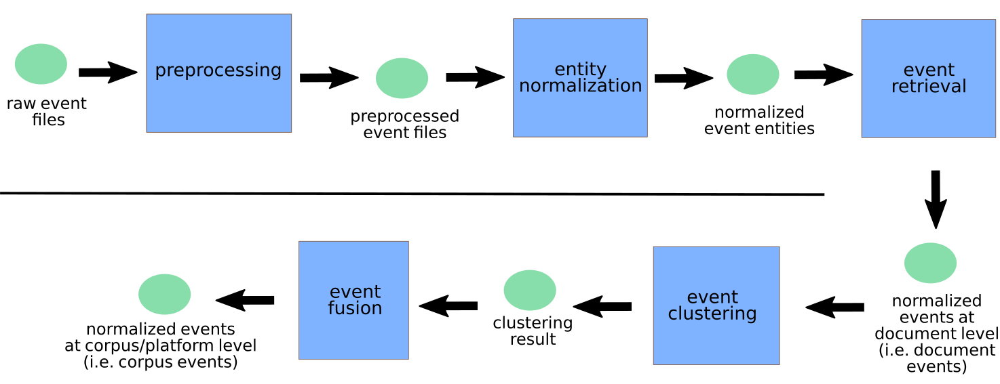

# epidnews2event
Epidemiological normalized event extraction from structured (e.g. tabular form) or unstructured (e.g. news) data. This specific branch of this repository is dedicated to the work conducted by INRAE/CIRAD and LIRMM in Montpellier for the specific end-user needs of [ESA](https://plateforme-esa.fr/fr) in the context of the [MOOD project](https://mood-h2020.eu/). Concretely, ESA aims to perform a more thorough surveillance of avian influenza cases for mammals.

* Nejat Arinik [nejat.arinik@inrae.fr](mailto:nejat.arinik@inrae.fr)
* Julien Rabatel [jrabatel@gmail.com](mailto:jrabatel@gmail.com)
* Mathieu Roche [mathieu.roche@cirad.fr](mailto:mathieu.roche@cirad.fr)


## Description

This set of `Python` scripts is designed for extracting normalized epidemiological events provided by Event-Based Surveillance (EBS) platforms. In our work, we define an epidemiological event as the detection of the virus at a specific date and time and in a specific location. The code is mainly designed to handle six different EBS platforms: [PADI-web](https://padi-web.cirad.fr), [ProMED](https://promedmail.org/), [EMPRES-i](https://empres-i.apps.fao.org), [WAHIS](https://www.woah.org/en/what-we-do/animal-health-and-welfare/disease-data-collection/world-animal-health-information-system/), [APHIS](https://www.aphis.usda.gov/aphis/ourfocus/animalhealth/animal-disease-information/avian/avian-influenza/hpai-2022/2022-hpai-mammals) and [APHA](https://www.gov.uk/government/publications/bird-flu-avian-influenza-findings-in-non-avian-wildlife/confirmed-findings-of-influenza-of-avian-origin-in-non-avian-wildlife#contents).

Moreover, we use the following tools for event entity normalization:

* Spatial entity: [GeoNames](https://www.geonames.org/).
* Host entity: [NCBI](https://www.ncbi.nlm.nih.gov/). We use the following preprocessed files in the context of the MOOD project: [MOOD-data-processing-pipeline](https://github.com/sib-swiss/MOOD-data-processing-pipeline).
* Disease entity: a custom basic taxonomy scheme


## Data

For reproducibility purpose, we provide some samples from the data collected by PADI-web, ProMED, EMPRES-i, WAHIS, APHIS and APHA in the `in` folder. Hence, it is possible to run the source code with these samples. Please contact us for the complete datasets.


## Workflow
{width=900}


## Organization

* Folder `in`:

  * Folder `padiweb`: Raw event data from PADI-web. The raw input event data is unstructured. It needs some preprocessing operations compared to other EBS platforms.
  * Folder `promed`: Raw unnormalized event data from ProMED. The raw input event data is structured.
  * Folder `empres-i`: Raw unnormalized event data from Empres-i. The raw input event data is structured.
  * Folder `wahis`: Raw event data from WAHIS. The raw input event data is structured.
  * Folder `aphis`: Raw unnormalized event data from APHIS. The raw input event data is structured.
  * Folder `apha`: Raw unnormalized event data from APHA. The raw input event data is structured.
  * 
* Folder `out`: contains the files produced by this program

* Folder `src`: 

  * Folder `event`: this folder contains event-related classes, such as Diseae, Location, Temporality and Host.
  * Folder `preprocessing`: this folder contains the scripts performing the preprocessing step. It essentially retrieves event related entities without performing the normalization task.
  * Folder `event_normalization`: this folder contains the scripts performing the normalization task.
  * Folder `event_retrieval`: this folder contains the scripts performing the event retrieval task, once the normalization step has been performed.
  * Folder `event_clustering`: the folder contains the implementations for event clustering.
  * Folder `event_fusion`: he folder contains the implementations for event fusion.
  * Folder `geocoding`: this folder contains the scripts performing the geocoding task. This task consists in assigning geographic coordinates to spatial entities.
  * Folder `media_sources`: this folder contains the scripts performing the processing of media source information.
  * Folder `util`: this folder contains some useful functions used in the rest of the code.


## Installation

* Install [Maven](https://maven.apache.org/) (tested with Python 3.8.5).

* Install Python (tested with Python 3.8.12)

* Install Python dependencies using the following command:

  ```
  pip install -r requirements.txt

  ```

* Run the java dependencies for the package SUTime (check [this website](https://pypi.org/project/sutime/) for more information):

  ```
  mvn dependency:copy-dependencies -DoutputDirectory=./jars -f $(python3 -c 'import importlib; import pathlib; print(pathlib.Path(importlib.util.find_spec("sutime").origin).parent / "pom.xml")')

  ```

* Download this project from this repository: https://github.com/arinik9/epidnews2event/tree/esa

* We have already put sample datasets in the `in/events` folder. For the complete data, please contact us. If you have already downloaded the complete data, unzip the file `raw_event_data.zip` and place the folders under `raw_event_data/in` into the `in` folder.
  
* Update the variable `MAIN_FOLDER` in the file `src/user_consts.py` for your main directory absolute path (e.g. `<YOUR_FOLDER>/epidnews2event`). You may update the variables `USER_HOST_TYPES` and `USER_DISEASE_NAME` in `src/user_consts.py` as well. But, this work focuses on avian influenza cases for mammals.

* Finally, add the main folder absolute path into `PYTHONPATH`:

  ```
  export PYTHONPATH="$PWD"

  ```

* (Optional) GeoNames applies an hourly limit quota for API queries. In order to take advantage the GeoNames' API as much as possible, we are using multiple GeoNames accounts. The description of these accounts are found in the file `src/user_consts.py` (with the variables `GEONAMES_API_USERNAME<NO>`, where `<NO>` is an integer value). If necessary, you can also increase the number of these accounts. In which case, you need to update the files under `src/geocode`.


## How to run ?

* Go to the main folder (e.g. `<YOUR_FOLDER>/epidnews2event`).

* Run the file `src/main.py`.


